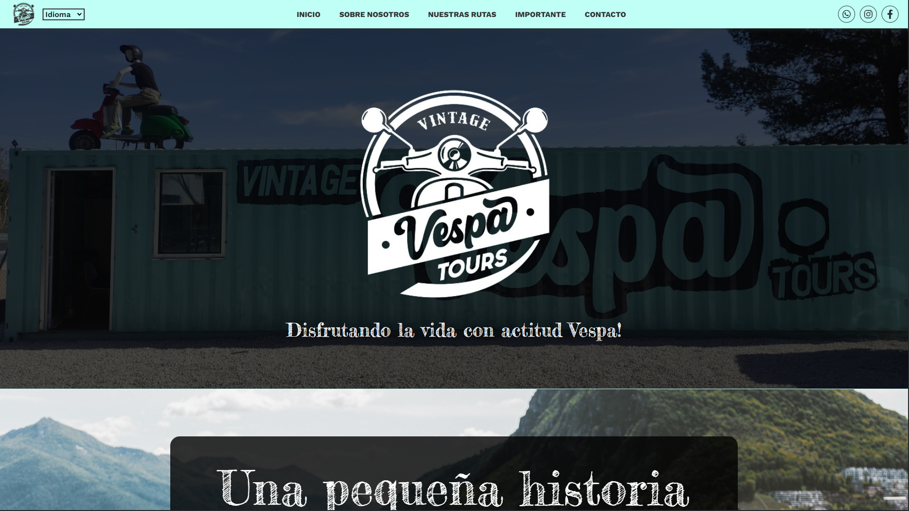
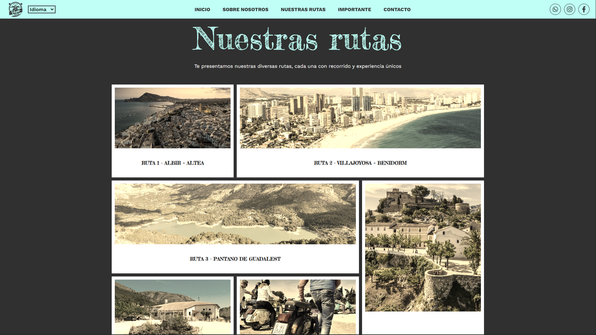
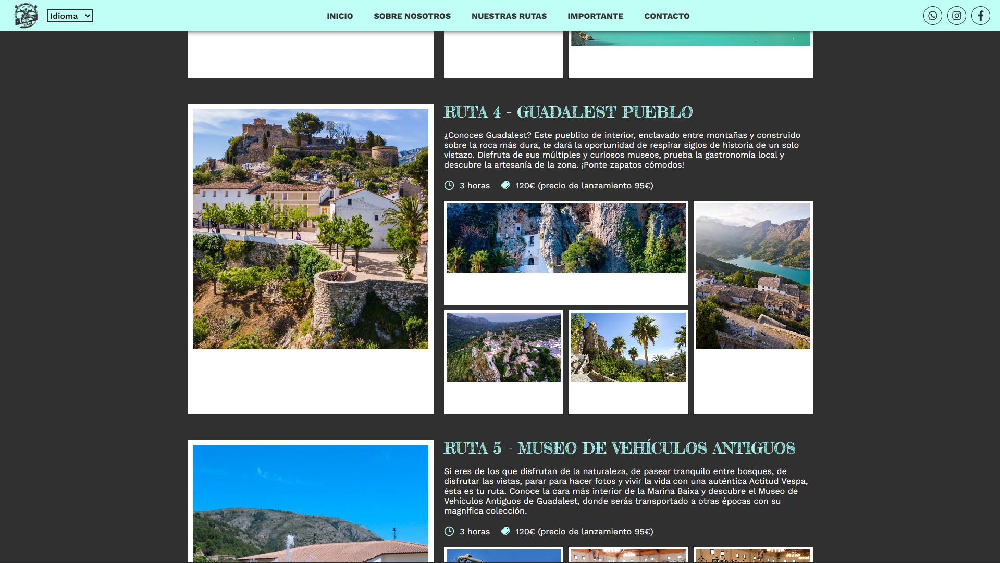
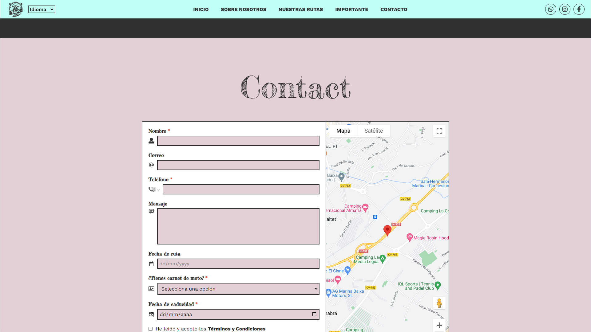
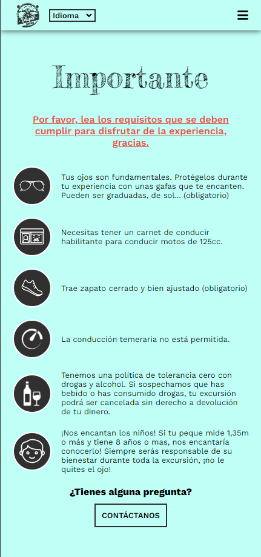
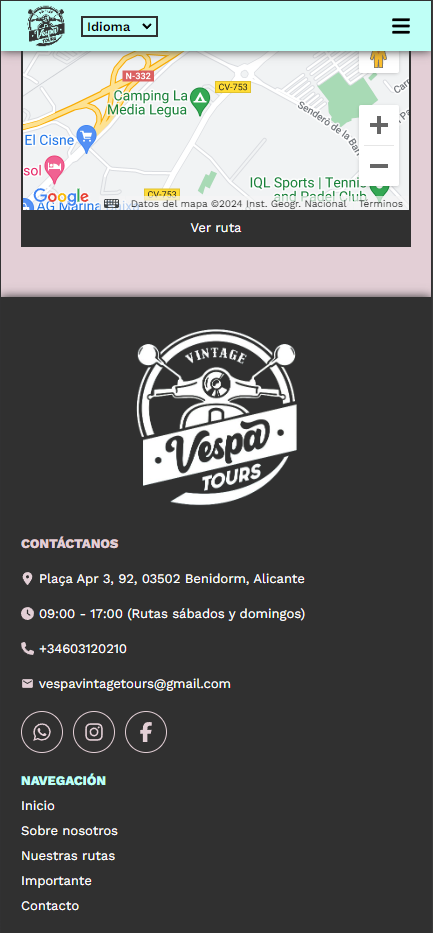
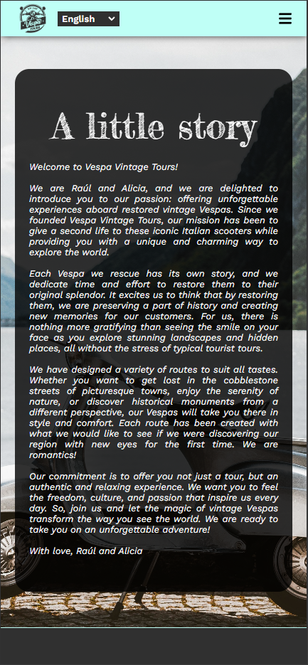
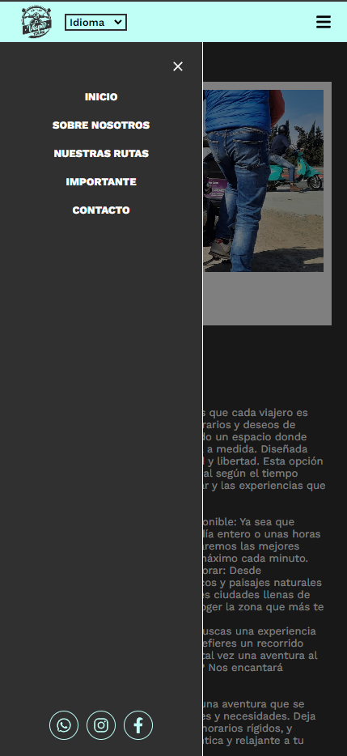

# Vespa Vintage Tour - Sitio web


## Tabla de contenidos

-   [Descripción del proyecto y objetivo](#descripción-del-proyecto-y-objetivo)
-   [Capturas de pantalla](#capturas-de-pantalla)
-   [Características](#características)
-   [Tecnologías](#tecnologías)
-   [Despliegue](#despliegue)
-   [Instrucciones de uso](#instrucciones-de-uso)
-   [Variables de entorno](#variables-de-entorno)
-   [Estructura del proyecto](#estructura-del-proyecto)
-   [Contribución](#contribución)
-   [Licencia](#licencia)
-   [Contacto](#contacto)
-   [Agradecimientos](#agradecimientos)

## Descripción del Proyecto y Objetivo

Este proyecto consiste en el desarrollo de la página web de [Vespa Vintage Tours](https://www.vespavintagetours.com), una empresa de excursiones, en
la cual se ofrece a los clientes diferentes rutas de viaje que serán recorridas en las cláicas motocicletas Vespa. Se trata de un trabajo freelance
cuyo objetivo es proporcionar a los clientes información detallada sobre las diferentes rutas, información para el viaje, facilidades de contacto y
más.

## Capturas de pantalla

<p align="center">
    
    
</p>
<p align="center">
    
    
</p>
<p align="center">
    
    
    
    
</p>

## Características

-   Diseño web moderno y responsivo, adaptado a todas las resoluciones de pantalla.
-   Utilización de la [API de Google Maps](https://developers.google.com/maps) junto con la biblioteca
    [react-google-maps](https://visgl.github.io/react-google-maps/) para renderizar un mapa interactivo y mostrar la ubicación del local.
-   Implementación del servicio de [EmailJS](https://www.emailjs.com/) para gestionar el envío de correos electrónicos mediante un formulario al
    correo de la empresa.
-   Selector de idiomas mediante la implementación de la librería [react-i18next](https://www.npmjs.com/package/react-i18next).
-   Selector de código de área móvil mediante la implementación de la librería
    [react-phone-number-input](https://www.npmjs.com/package/react-phone-number-input).
-   Selector de fechas limitadas a fin de semana mediante la implementación de la librería [flatpickr](https://flatpickr.js.org/).
-   Descarga de archivos informativos.
-   Implementación de variables de entorno, con el objetivo de mantener la privacidad y seguridad del usuario y ocultar información sensible.

## Tecnologías

-    **Vite:** Se utilizó como generador de proyeto y entorno de desarrollo.
-    **React:** Se utilizó como freamwork de desarrollo del cliente.
-    **Npm:** Se utilizó para la incorporación de librerías como react-router-dom, react-slick,
    nodemon, etc.
-    **Vercel:** Se utilizó para el despligue de la aplicación.

## Despliegue

Este proyecto ha sido desplegado en mediante el servicio gratuito de [Vercel](https://vercel.com/).

## Instrucciones de uso

Para correr este servicio de manera local deberá seguir los siguientes pasos:

1. Clone este repositorio en tu máquina local con el comando:
    ```bash
    git clone https://github.com/Gaston-Valentini/vespa-vintage-tour-client.git
    ```
2. En la carpeta que se generó el proyecto, instale las dependencias con el comando:
    ```bash
    npm install
    ```
3. Cree un archivo .env en la raíz del proyecto y configurar las variables de entorno como se ejemplifica en el archivo .env.example.
4. Para desplegar el proyecto de manera local, deberá ejecutar el comando:
    ```bash
    npm run dev
    ```
5. Visite en un navegador la dirección http://localhost:5173.

## Variables de entorno

-   VITE_GOOGLE_API_KEY (Clave API del servicio de Google Maps)
-   VITE_GOOGLE_PLACE_ID (Place ID del local en Google Maps)
-   VITE_EMAILJS_SERVICE_ID (Id del servicio generado en EmailJS)
-   VITE_EMAILJS_TEMPLATE_ID (Id de la plantilla que se utilizará para dar forma al correo electrónico de EmailJS)
-   VITE_EMAILJS_PUBLIC_KEY (Clave pública del usuario de EmailJS)

## Estructura del proyecto

```
benilaser-client/
├── public/ (Contiene las imágenes del README.md)
├── src/
│   ├── assets/ (Contiene contenido multimedia)
│   ├── components/ (Contiene componentes reutilizables)
│   ├── data/ (Contiene los archivos de información y datos)
│   ├── locales/ (Contiene los archivos de traducciones)
│   ├── sections/ (Contiene las secciones de la web)
│   ├── App.jsx (Contiene toda la aplicación que se renderizará en el root de index.html)
│   ├── App.module.css (Contiene los estilos generales del componente App)
│   ├── index.css (Contiene las configuraciones generales de estilo y variables globales)
│   └── main.jsx (Se encarga de insertar el componente App en el root de index.html)
├── .env.example (Contiene los ejemplos de las variables de entorno)
├── .gitignore (Contiene los archivos y carpetas que deben ser ignorados por git)
├── index.html (Archivo principal que renderiza la aplicación en el navegador)
├── LICENSE (Contiene toda la información pertinente a la licencia del proyecto)
├── package-lock.json (Asegura la instalación consistente y reproducible de las versione exactas de las dependencias del proyecto)
├── package.json (Define las configuraciones básicas, metadatos y dependencias necesarias del proyecto)
├── README.md (Contiene una guía detallada del proyecto)
└── vite.config.js (Configura y personaliza el comportamiento de Vite)
```

## Contribución

¡Tus contribuciones son bienvenidas! Si deseas informar de problemas, proponer mejoras o enviar solicitudes no dudes en hacérmelo saber a través de mi
[LinkedIn](https://www.linkedin.com/in/gastonvalentini/)

## Licencia

Este proyecto está bajo la licencia de Creative Commons Attribution-NonCommercial-NoDerivatives (CC BY-NC-ND).

## Contacto

Para preguntas o colaboraciones, puedes contactarme a través de mis redes:

-   [LinkedIn](https://www.linkedin.com/in/gastonvalentini/)
-   [GitHub](https://github.com/Gaston-Valentini)
-   [gastonvalentiniruiz@gmail.com](mailto:gastonvalentiniruiz@gmail.com)
-   [+34623271806](tel:+34623271806)

## Agradecimientos

Me gustaría agradecer a todo el equipo de Benilaser por hacer posible esta colaboración.

[Volver al inicio](#vespa-vintage-tour---sitio-web)
